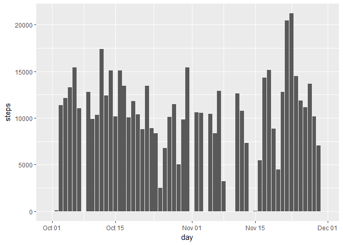
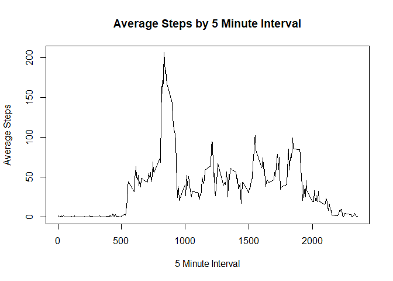
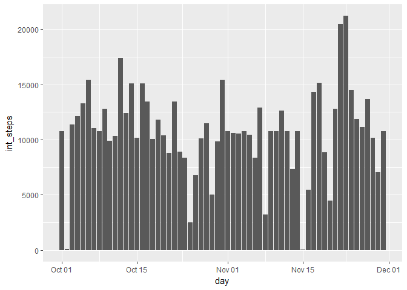
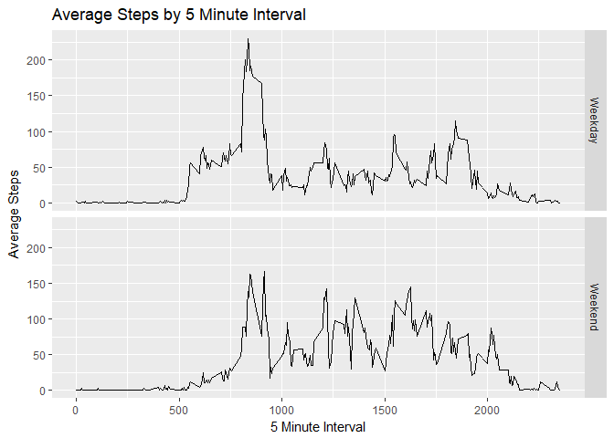

## Loading and preprocessing the data

Loading packages

```r
library(dplyr)
```

```
## 
## Attaching package: 'dplyr'
```

```
## The following objects are masked from 'package:stats':
## 
##     filter, lag
```

```
## The following objects are masked from 'package:base':
## 
##     intersect, setdiff, setequal, union
```

```r
library(ggplot2)
```

Read in data


```r
unzip("activity.zip")
act <- read.csv("activity.csv")
```

Summarize the data by interval

```r
day_sum <- act[,1:2] %>% group_by(date) %>% summarize_all(sum, na.rm=TRUE)
day_sum$day <- as.Date(day_sum$date,"%Y-%m-%d")

int_mean <- act[,c(1,3)] %>% group_by(interval) %>% summarize_all(mean,na.rm=TRUE)
```


## What is mean total number of steps taken per day?

Plot mean steps per day

```r
ggplot(day_sum, aes(day,steps)) +geom_bar(stat = "identity")
```

<!-- -->

Mean Steps

```r
mean(day_sum$steps)
```

```
## [1] 9354.23
```
Median Steps

```r
median(day_sum$steps)
```

```
## [1] 10395
```


## What is the average daily activity pattern?

Plot mean of steps per interval

```r
plot(int_mean$interval,int_mean$steps,type='l',ylab="Average Steps", xlab="5 Minute Interval", main="Average Steps by 5 Minute Interval")
```

<!-- -->

Interval with the most steps, on average, across all days

```r
int_mean[int_mean$steps==max(int_mean$steps),]$interval
```

```
## [1] 835
```


## Imputing missing values

Determine number of missing values

```r
sum(is.na(act$steps))
```

```
## [1] 2304
```

Replace missing values with the average steps for that interval

```r
int_mean$int_steps <- as.integer(round(int_mean$steps))

act2 <- merge(act,int_mean,by.x = "interval", by.y = "interval")
act2[!is.na(act2$steps.x),]$int_steps <- act2[!is.na(act2$steps.x),2]
```

Summarize the data data by day and plot total steps by day

```r
day_sum2 <- act2[,c("date","int_steps")] %>% group_by(date) %>% summarize_all(sum, na.rm=TRUE)
day_sum2$day <- as.Date(day_sum2$date,"%Y-%m-%d")

ggplot(day_sum2, aes(day,int_steps)) +geom_bar(stat = "identity")
```

<!-- -->

Determine new mean and median

```r
mean(day_sum2$int_steps)
```

```
## [1] 10765.64
```

```r
median(day_sum2$int_steps)
```

```
## [1] 10762
```

Compare vs. with missing values

```r
comp <- data.frame(with.NA = c(mean(day_sum$steps),median(day_sum$steps)),imputed.NA = c(mean(day_sum2$int_steps),median(day_sum2$int_steps)), row.names = c("mean","median"))
comp$difference <- comp$imputed.NA - comp$with.NA
```

From this we can see we added 1411 steps to the daily average steps

## Are there differences in activity patterns between weekdays and weekends?

Mark each row as either "Weekday" or "Weekend"

```r
act2$day <- as.Date(act2$date,"%Y-%m-%d")
act2$weekday <- "Weekday"
act2$weekday[weekdays(act2$day) == "Saturday" | weekdays(act2$day) == "Sunday"] <- "Weekend"
act2$weekday <- as.factor(act2$weekday)

week_mean <- act2[,c("interval","weekday","int_steps")] %>% group_by(weekday, interval) %>% summarize_all(mean, na.rm=TRUE)
```

Plot comparing Weekend vs. Weekday average activity

```r
ggplot(week_mean, aes(interval,int_steps)) + geom_line() + facet_grid(weekday ~ .) + labs(title="Average Steps by 5 Minute Interval", x="5 Minute Interval", y="Average Steps")
```

<!-- -->
